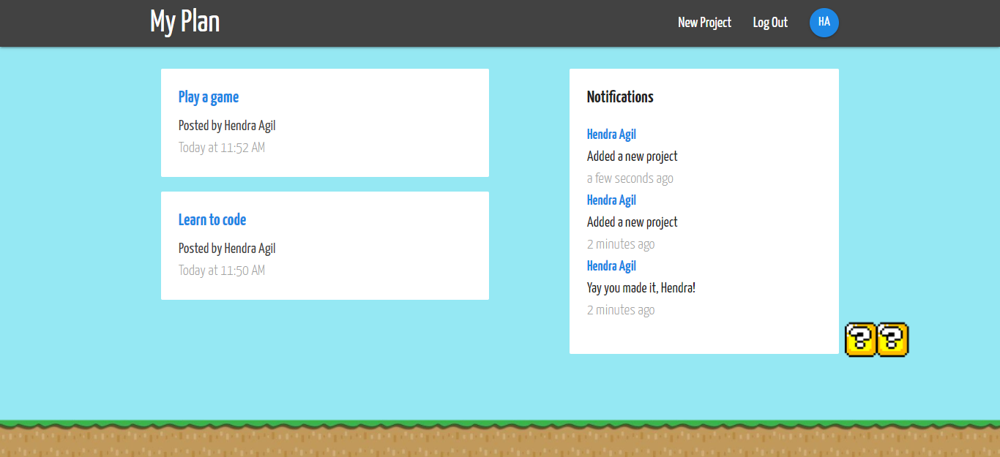

# My Plan App

### To run this app in your machine :
1. Clone this repository  
   `git clone git@github.com:hendraaagil/my-plan.git`
2. Install dependencies  
   `npm install`
3. Change with your own firebase config on  
   `src/config/fbConfig.js`
4. Run app 
   `npm start`

> Thank you, [@hendraaagil](https://github.com/hendraaagil)
